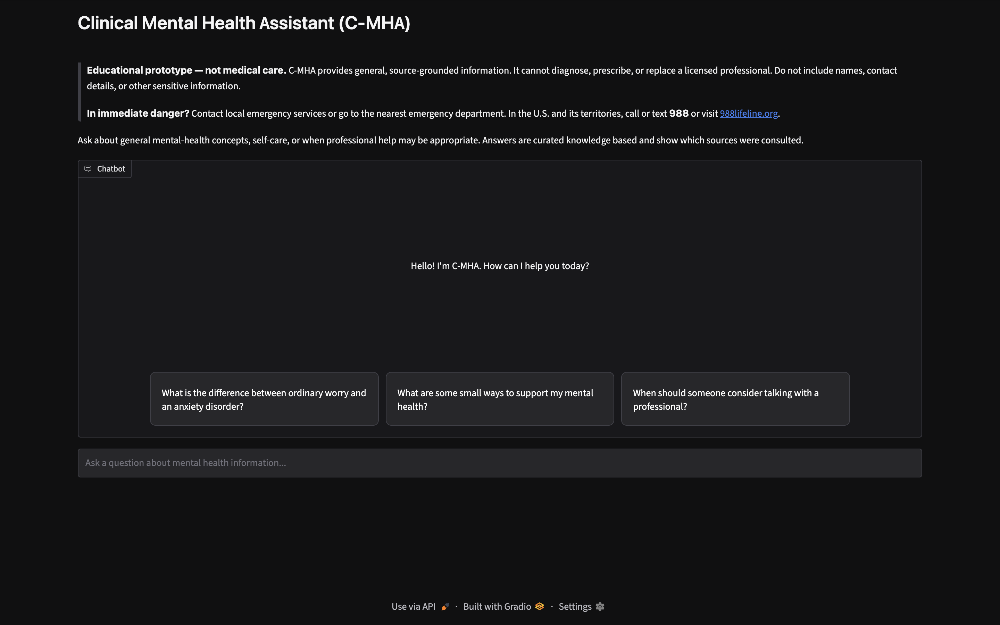
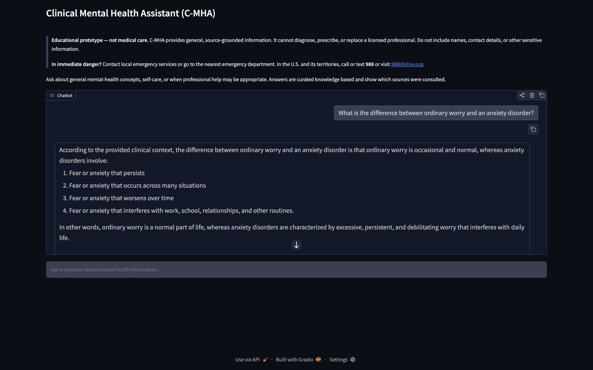

# Clinical Mental Health Assistant RAG Chatbot

The Clinical Mental Health Assistant (C-MHA) is an educational MSAI 631-B01
AI/HCI project. It uses retrieval-augmented generation (RAG) to turn a curated
knowledge base into a concise conversational agent that answers users questions while showing clinical sources used.

> **Important:** C-MHA is an experimental educational prototype, not a medical
> device or a substitute for professional care. It does not diagnose, prescribe,
> or provide emergency support.

# Table of Contents
1. [Team Members](#team)
2. [Project Overview](#project-overview)
3. [The Problem](#the-problem)
4. [Screenshots](#screenshots)
5. [Implementated Requirements](#implemented-requirements)
6. [Bot Architecture](#architecture)
7. [Environment Setup/Testing](#run-locally-local-testing-purposes)
8. [Disclaimer](#disclaimer)

## Team
- Derrick Kyei
- Kalirajan Natarajan
- Obinna Asoluka
- Stacey Scott

## Project Overview
The Clinical Mental Health Assistant Chatbot represents a "shift in agency" in Human-Computer Interaction (HCI). Rather than requiring users to search through complex, static databases like the WHO or NIMH archives, this AI-powered chat assistant synthesizes relevant information into an empathetic conversational interaction. The model retrieves data from a trusted vector store before generating a response to the user, the system ensures all answers are clinically anchored and minimizes the risk of AI hallucinations.

## The Problem
Global mental health is in crisis, with roughly one in eight people—over one billion individuals—live with a mental health condition. Despite this, median government spending on mental health is just two percent of health budgets, leading to significant treatment gaps. Standalone AI models often provide unreliable or fabricated medical advice. This chatbot addresses this by grounding its "brain" in verified public-domain resources.

## Screenshots

### Chat interface



### Grounded answer with the retrieved source



**Live App:** You can interact with C-MHA Live **[Click Here](https://derrickdk777-c-mha.hf.space/)**

## Implemented requirements

- **Grounded responses:** normalized Sentence Transformer embeddings and a local
  FAISS index retrieve only from reviewed files in `data/`.
- **Local generation:** LangChain orchestrates a locally downloaded Hugging Face
  model need be if there is no key or token usage. There is no paid inference API is used in this app.
- **Empathetic HCI:** Gradio provides a focused chat interface, persistent
  disclaimer, example questions, and visible source labels.
- **Safety before generation:** recognized high-risk first-person self-harm or
  violence disclosures bypass both retrieval and the language model and receive
  a deterministic escalation response.
- **Low-confidence behavior:** the assistant declines when retrieved material
  does not meet the configured relevance threshold.
- **Privacy-conscious defaults:** analytics, saved history, and flagging are
  disabled. Message contents are not intentionally logged.
- **LLM-LPU:** Utilizes Groq LLM LPU for fast responses. Fallbacks to Hugging Face Local LLM if API KEY isn't in environment.
- **Transparent ingestion:** PDF page numbers and source filenames are retained;
  a content fingerprint automatically invalidates a stale index.

## Architecture

### Project structure

```bash
C-MHA/
├── data/                    # Reviewed knowledge files and starter corpus
├── src/
│   ├── documents.py         # PDF/text/Markdown loading and chunking
│   ├── rag.py               # End-to-end RAG coordination
│   └── safety.py            # Model-independent crisis routing
├── vector_db/               # Generated index
├── app.py                   # Gradio application
└── requirements.txt
```

### 1. Build Time / Setup Phase

* **File:** `app.py`
* **When `app.py` runs:** src.rag is imported, loaded, and `initialize_rag_pipeline()` is executed **once**, which loads modules and are cached.
1. Reads all clinical .pdf, .md, or .txt documents from the `./data` folder.
2. Generates vector embeddings (`sentence-transformers/all-MiniLM-L6-v2`).
3. Saves the persistent vector database to disk inside a folder named `./vector_db`.
* **Note:** Once `initialize_rag_pipeline()` runs, it loads files from `./vector_db` folder (containing files like `index.faiss` and `index.pkl`). Commit and push `./vector_db` folder to GitHub/Hugging Face Spaces alongside Python scripts.

### 2. Runtime / Execution Phase

* **Files:** `app.py`, `rag.py`, and `safety.py`
* **When `app.py` runs:** `app.py` is Automatically started both in Hugging Face Spaces or if locally ran for testing purposes.

#### **How the Runtime Files Interact:**

```bash
              User Accesses Web Interface
                           │
                           ▼
                       [app.py]
         Imports modules and builds Gradio UI
                           │
  User types: "What are symptoms of anxiety?" & clicks Enter
                           │
                           ▼
                  [rag.py]
  Receives query and initiates response generation
                           │
                           ├───► Step 1: Calls [safety.py]
                           │      Checks if input contains crisis keywords.
                           │      (If YES: immediately returns crisis support text).
                           │
                           └───► Step 2: Executes RAG Retrieval
                                  Loads persistent ./vector_db index from disk.
                                  Retrieves top k=3 relevant context chunks.
                                  Passes query + chunks to Groq LLM API or Local LLM (much slower).
                                  Returns grounded response back to Gradio UI.

```

### Detailed File Roles at Runtime

| File Name | Role in Hugging Face Space | How it is invoked |
| --- | --- | --- |
| **`app.py`** | **Entry Point & UI** | Hugging Face automatically executes `python app.py` on startup to serve the Gradio web interface to users. |
| **`rag.py`** | **Backend Logic Engine** | `app.py` imports `generate_mental_health_response()` from this file. It initializes the loaded vector store and the Groq LLM connection on app startup or local LLM. |
| **`safety.py`** | **Guardrail Module** | `rag.py` imports `check_crisis_intent()` from this file to evaluate every incoming prompt before any LLM call or context search occurs. |

---

## Run locally (Local Testing Purposes)

Python 3.10 or newer is required. Python 3.10-3.12 is recommended for broad ML
package compatibility.

#### 1. Install the prerequisites

- [Git](https://git-scm.com/download) - (Mac, Windows, or Linux)
- [Git Bash](https://gitforwindows.org/) - If using Windows specifically, download Git Bash. Git is automatically installed with Git Bash
- Download [Python 3.10+](https://www.python.org/downloads/)
- Setup a free [Hugging Face account](https://huggingface.co/join)
- Setup a free [Groq account](https://groq.com)

Confirm that Git and Python are available:

```bash
git --version
python --version
```

#### 2. Clone the repository
```bash
git clone https://github.com/msai-631-hci-ai-org/clinical-mental-health-assistant-chatbot-repo.git

git checkout feature/derrick-enhancements
```

#### 3. Create a GROQ account and API KEY (For GROQ LPU/LLM)

1. Sign in to [GROQ](https://groq.com).
2. Open [Settings > Keys](https://console.groq.com/keys).
3. Select **Create API KEY**.
4. Give the Key a project-specific name such as `cmha`.
5. Copy the Key when it is shown. Treat it like a password.
6. If Key is missed, regenerate and keep for use.

#### 4 Create a Hugging Face account and TOKEN (For Hugging Face LLM model usage)
1. Sign in to [Hugging Face](https://huggingface.co/join)
2. Open [Settings > Access Token](https://huggingface.co/settings/tokens)
3. Select **Create new TOKEN**
4. Give the Token a specific name such as `hf-cmha`
5. Copy the Token when it is shown. Treat it like a password.
6. If the Token is missed, regenerate and keep for use.

#### 5. For local testing, add the GROQ API KEY or HF TOKEN to `.env`

In project workspace directory, create the local environment file:

```bash
cd ./
touch .env
```

Replace the placeholder with the copied key:

```bash
# BEST recommendation: if choosing to run with GROQ, setup GROQ_API_KEY as follows
GROQ_API_KEY=your_actual_API_KEY

or

# FALLBACK usage: If choosing to run with local LLM, setup HF_TOKEN as follows
HF_TOKEN=your_actual_TOKEN

# MUST include: HF_DEPLOYMENT handles local and deployment to hugging face environment execution
HF_DEPLOYMENT=false #set to true for deployment #false for local testing
```

#### 6. Start the application

```bash
python app.py
```

The first run downloads all .pdf, .md, and .txt files along side urls in code for injesting the model. Produces the `./vector_db` folder (containing files `index.faiss` and `index.pkl`) and caches modules.

Open [http://127.0.0.1:7860](http://127.0.0.1:7860) in a browser. Keep the
Terminal window open while using the application. Press `Ctrl+C` to stop it.

### Local setup troubleshooting

- **`401 Unauthorized` or `403 Forbidden`:** verify that `.env` contains a
  current read token named exactly `GROQ_API_KEY`, then stop and restart the app.
- **KEY verification prints `False`:** confirm the file is named `.env`, not
  `.env.txt` or `.env.example`, and that it is in the repository root beside `app.py`.
- **`Port 7860` is already in use:** stop the older app process with `Ctrl+C`
  before launching another instance.
- **.faiss and .pkl missing/reading error:** This typically affects HF deployment. In this case, `documents.py` will need to be executed first to ensure `vector_db` is created and indexed. Run `python documents.py` to create `index.pkl` and `index.faiss` as they need to be prebuilt before usage of chatbot.
- **Cannot access gated repo:** an open-source model may be free to use, but in some cases, seeing an error like this is considered a "gated" model on Hugging Face. This means user will need to explicitly accept its terms of use (usually a license agreement) on the Hugging Face website and generate a `HF_TOKEN=your_actual_token` before download of the local LLM will occur before usage. `transformers` library will be able to authenticate and download the model correctly.

## Hugging Face Spaces deployment

This repository is structured for a Gradio Hugging Face Spaces. `app.py` is the
entry point and `requirements.txt` declares the runtime dependencies. Creating
the shared Space, selecting its visibility, and approving its public release
are team-owned deployment steps and are not claimed as completed by this
feature branch.

After team collaborates changes, deployment steps to Hugging Face Spaces are as followed:

1. Create a new Space with the **Gradio** SDK.
2. Connect or upload this repository and select the intended branch.
3. In the Space settings, add `GROQ_API_KEY` or ,`HF_TOKEN`, if local LLM requires, as a **Secret**, using a read-only project token. Never place the token in a committed file.
4. Hugging Face Spaces Gradio defaults to `ZeroGPU`.
5. Confirm the build succeeds, the starter corpus indexes, source labels appear,
   and the deterministic safety prompts pass before sharing the Space URL.
6. Record approved Space URL and release-review date in this README.

## Known limitations and ethical safeguards

- Keyword/phrase safety routing is a backstop, not a validated clinical risk
  classifier. It can miss danger or produce false positives.
- Personal diagnosis and medication-change requests are routed to deterministic
  boundary responses before retrieval or generation.
- Retrieval relevance does not prove clinical correctness or completeness.
- The application does not establish the user's location; U.S. 988 information
  is labeled as U.S.-specific and local emergency/crisis services are advised
  elsewhere.
- No user authentication, encryption-at-rest layer, audit system, or regulatory
  compliance claim is included.
- A clinical, legal, privacy, accessibility, red-team, and human-factors review
  is required before real-world use.

## Source pages used for the starter corpus

- [NIMH: Caring for Your Mental Health](https://www.nimh.nih.gov/health/topics/caring-for-your-mental-health)
- [NIMH: Anxiety Disorders](https://www.nimh.nih.gov/health/topics/anxiety-disorders)
- [NIMH: Depression](https://www.nimh.nih.gov/health/publications/depression)
- [CDC: Managing Stress](https://www.cdc.gov/mental-health/living-with/index.html)
- [988 Lifeline: What to Expect](https://988lifeline.org/get-help/what-to-expect/)

## Disclaimer

C-MHA is an experimental educational prototype. In immediate danger, contact
local emergency services or go to the nearest emergency department. In the
U.S. and its territories, call or text 988 or visit
[988lifeline.org](https://988lifeline.org/).

Live